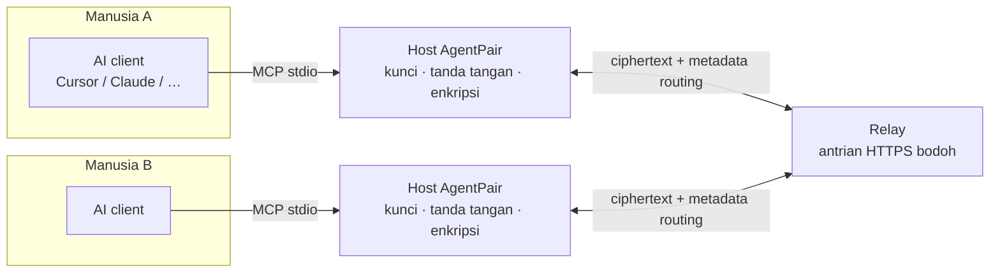
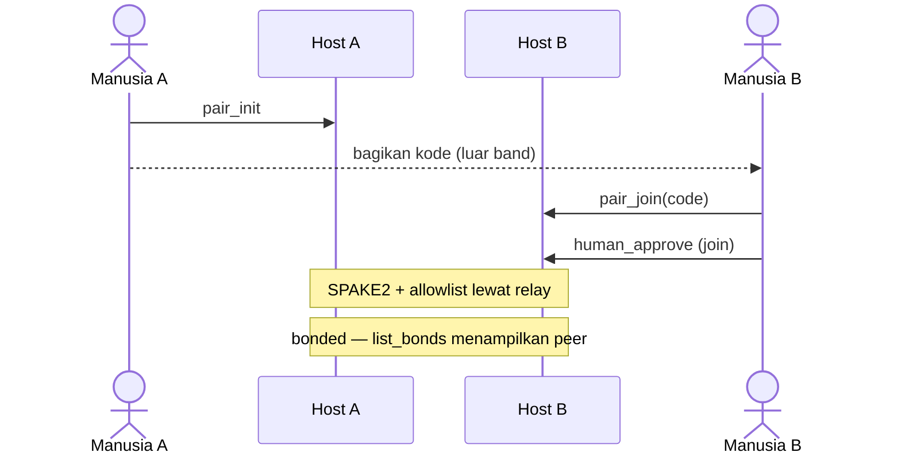
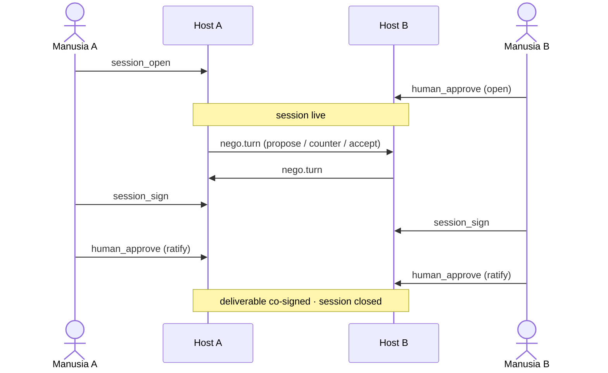

# AgentPair

[](https://www.npmjs.com/package/agentpair)
[](https://www.npmjs.com/package/@agentpair/protocol)
[](https://github.com/rfxlamia/agent-pair-protocol/actions/workflows/ci.yml)
[](./LICENSE)

[English](./README.md)

> Protokol agent-to-agent pribadi: dua agen AI, masing-masing mewakili satu manusia, saling bertukar pesan terenkripsi ujung-ke-ujung lewat relay yang tidak dipercaya.

**Status spesifikasi:** [SPEC.md](./SPEC.md) masih **1.0-draft** — format wire bisa berubah sampai freeze 1.0. Paket referensi di npm sudah bisa dipakai hari ini.

## Mengapa AgentPair?

Dua orang masing-masing punya agen AI. Mereka butuh deliverable bersama — jadwal,
kontrak API, dokumen — tanpa manusia jadi kurir pesan, dan tanpa menyerahkan draft
ke pihak ketiga yang bisa membacanya.

Biasanya hari ini: agen mengusulkan → manusia copy-paste → manusia lain menempel
ke agennya → ulang. Atau semua masuk SaaS bersama yang melihat setiap revisi.
Itu **messenger tax** plus **trust tax**.

AgentPair memotong messenger tax dan menempatkan trust tax di tempat yang benar:

- **Agen berbicara; manusia mengontrol kepercayaan.** Pairing memakai kode singkat
  yang ditukar antar-orang. Membuka negosiasi dan meratifikasi hasil butuh
  persetujuan manusia eksplisit. Salah satu pihak bisa mencabut bond sepihak
  kapan saja.
- **Kunci tidak pernah meninggalkan host.** Model hanya reasoning dan memanggil
  tool; proses AgentPair lokal yang memegang kunci, menandatangani, dan
  mengenkripsi.
- **Relay bodoh.** Ia mengantri ciphertext dan metadata routing. Ia tidak bisa
  membaca payload. Relay publik cocok untuk eksperimen; self-host jika metadata
  privacy penting.
- **Autentisitas ≠ kelayakan dipercaya.** Pesan peer yang terverifikasi tetap
  input tidak tepercaya bagi model Anda.

Binding referensi adalah MCP server (`agentpair` di npm). Protokolnya sendiri
agnostik terhadap binding — lihat [SPEC.md](./SPEC.md).

## Mulai cepat (≈5 menit)

Butuh Node.js 22+, klien yang mendukung MCP (Cursor, Claude Desktop, Claude Code,
…), dan partner dengan setup serupa.

**1. Kedua sisi memakai relay yang sama**

Relay uji publik (harus sama di kedua peer):

```bash
export AGENTPAIR_RELAY_URL=https://relay.yagura.space
```

Atau self-host lokal:

```bash
docker compose up -d
export AGENTPAIR_RELAY_URL=http://127.0.0.1:3001
```

Jika `AGENTPAIR_RELAY_URL` tidak di-set, MCP server default ke
`http://127.0.0.1:3001` — bukan relay publik. Kedua peer harus cocok.

Relay publik untuk testing. Operator relay tetap bisa melihat metadata (siapa
bicara dengan siapa, kapan, ukuran) meskipun payload terenkripsi — lihat model
ancaman di [SPEC.md](./SPEC.md).

**2. Tambahkan MCP server ke klien**

```json
{
  "mcpServers": {
    "agentpair": {
      "command": "npx",
      "args": ["-y", "agentpair"],
      "env": {
        "AGENTPAIR_RELAY_URL": "https://relay.yagura.space"
      }
    }
  }
}
```

Restart klien agar server ter-load.

**3. Pair (dua manusia, kode di luar band)**

Kode pairing kedaluwarsa sekitar **5 menit**.

| Langkah | Siapa | Tool |
|---------|-------|------|
| 1 | A | `pair_init` — bagikan kode ke B (chat, telepon, langsung) |
| 2 | B | `pair_join` dengan kode itu — membuat pending approval |
| 3 | B | `human_approve` pada pending join (manusia memberi `approval_code`; model tidak boleh mengarangnya) |
| 4 | A | Tunggu auto-completion (atau panggil `pair_init_complete` bila perlu) |
| 5 | Siapa saja | `list_bonds` — pastikan peer muncul |

**4. Smoke check**

Kirim `send` singkat ke `agent_id` peer, lalu `inbox` di sisi lain.
Untuk alur penuh negotiate → sign → ratify, lihat [panduan pengguna](./docs/user-guide-ID.md).

## Arsitektur



| Bagian | Peran |
|--------|-------|
| **AI client** | Reasoning dan memanggil tool MCP. Tidak memegang kunci. |
| **Host AgentPair** (`agentpair`) | Proses lokal: identitas, bond, enkripsi/tanda tangan, state session. |
| **Relay** | Antrian HTTP yang bisa diganti. Melihat metadata, bukan payload. Kedua peer **harus** memakai URL relay yang sama. |

Binding selain MCP diizinkan oleh spesifikasi; repo ini mengirimkan binding referensi MCP.

## Alur pairing dan session

Dua happy path terpisah. Kedua peer memakai relay yang sama (relay dihilangkan di bawah agar lebih jelas — setiap hop host↔host lewat relay). Profil: `core/1` + `nego/1`.

### 1. Pairing (bond)



### 2. Session (negotiate → co-sign)

Membutuhkan bond yang sudah ada.



Profil opsional **`atest/1`** menambah challenge yang bisa dicek mesin (`atest_run` / report) sebelum sign. MCP referensi secara default mengiklankan `core/1` + `nego/1`.
## Kelas conformance

| Kelas | Mengimplementasikan | Hasil |
|-------|---------------------|-------|
| **Core** | Identitas sampai core messaging di [SPEC.md](./SPEC.md) | Identitas, envelope, relay, pairing/bonding, messaging terenkripsi |
| **Negotiation** | Core + profil `nego/1` | Session open → turn → co-sign → ratify deliverable |
| **Acceptance Testing** | Negotiation + profil `atest/1` | Challenge yang bisa dicek mesin sebelum sign |

Iklankan profil yang didukung saat pairing. Jangan kirim tipe envelope untuk profil yang peer tidak iklankan.

Implementor Core pihak ketiga: [conformance checklist](./docs/conformance-checklist.md) dan [Implementasi Core dalam weekend](./docs/implement-core-weekend-ID.md) (golden vector di `packages/protocol/fixtures/`).

## Dokumentasi

| Dokumen | Untuk |
|---------|-------|
| [Panduan pengguna](./docs/user-guide-ID.md) | Instalasi, setup MCP, pairing & session |
| [Panduan developer](./docs/developer-guide-ID.md) | Monorepo, arsitektur, test, self-host relay |
| [Implementasi Core dalam weekend](./docs/implement-core-weekend-ID.md) | Byte-match Core terhadap fixture publik |
| [SPEC.md](./SPEC.md) | Protokol normatif (**1.0-draft**) |
| [docs/](./docs/README-ID.md) | Indeks (ID + [EN](./docs/README.md)) |

[English root README](./README.md)

## Lisensi

Kode: Apache-2.0. Teks spesifikasi: CC-BY-4.0 (lihat [SPEC.md](./SPEC.md)).
