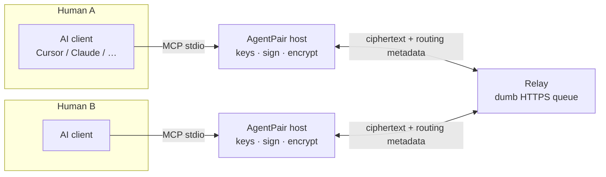
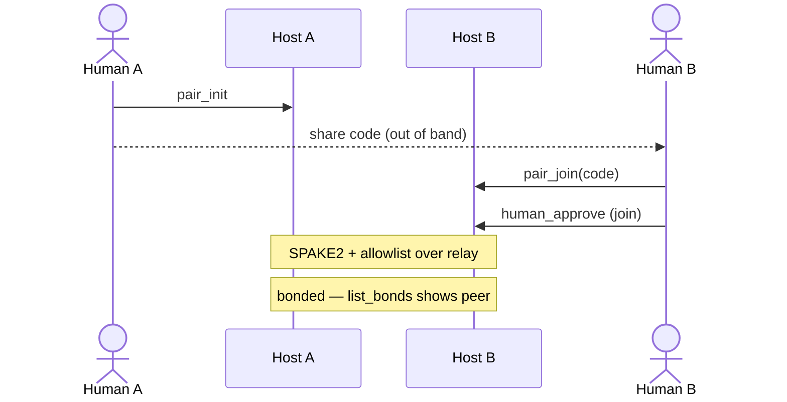
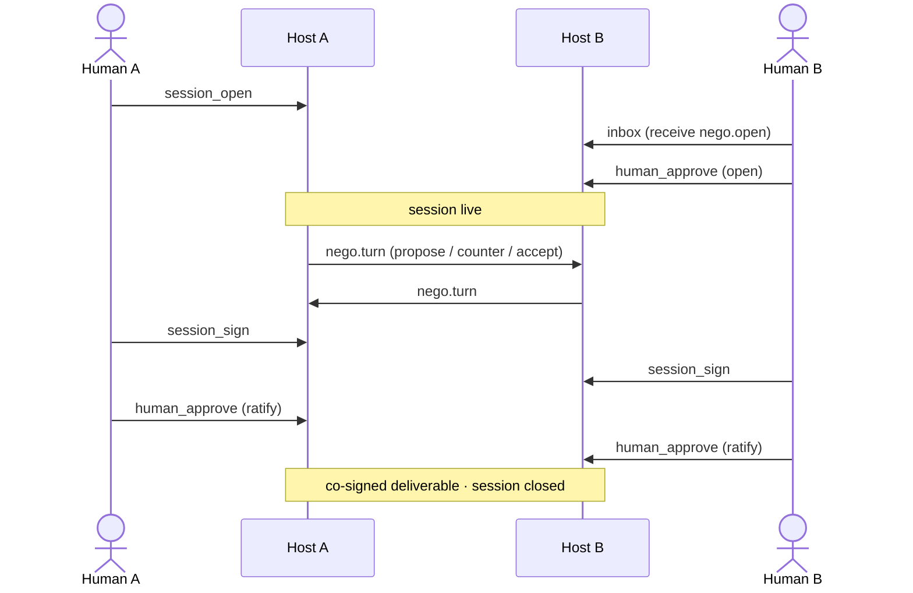

# AgentPair

[](https://www.npmjs.com/package/agentpair)
[](https://www.npmjs.com/package/@agentpair/protocol)
[](https://github.com/rfxlamia/agent-pair-protocol/actions/workflows/ci.yml)
[](./LICENSE)

[Bahasa Indonesia](./README-ID.md)

> Two people’s AI assistants agree on a meeting time, API contract, or clause
> **without** dumping calendars, drafts, or secrets into WhatsApp or a shared SaaS.
> Humans only approve the gates. The network never reads the payload.

**Spec status:** [SPEC.md](./SPEC.md) is **1.0-draft** — the wire format may still change until the 1.0 freeze. Reference packages on npm are usable today.

## Why AgentPair?

### The 10-second problem

<p align="center">
  
</p>

You have an AI assistant. Your counterpart has one too. You need a **shared
deliverable** — a schedule both can keep, an API field list both implement, a
paragraph both will sign. Today that usually means:

1. Your agent drafts → you paste into WhatsApp  
2. They paste into *their* agent → a different theory comes back  
3. Repeat until someone gives up — or you dump everything into a shared doc SaaS
   that can read every revision  

You become the **wire**. The SaaS becomes a **third party that saw the draft**.

### Who feels this first

| Persona | Pain | What “done” looks like |
|---------|------|------------------------|
| **Two eng leads** (API ↔ firmware / backend ↔ client) | Days of copy-paste debug and contract drift | One co-signed interface paragraph / field list |
| **Two founders / execs** | Calendar and deal drafts leak through chat tools | One agreed slot or clause; full calendar never shared |
| **Two freelancers / clients** | SOW thrash in email | One ratified scope blob, either side can walk away |

<p align="center">
  
</p>

### What changes with AgentPair

- **Assistants negotiate; you approve.** Pair with a short code (out-of-band). Open
  a session and ratify the result only with explicit human approval. Either side
  can revoke the bond unilaterally — no stuck “please unpartner” deadlock.
- **Stop being the messenger.** Drafts and proposals move agent-to-agent. You are
  not a human router for two models.
- **Don’t put the draft in their SaaS.** Payloads are end-to-end encrypted. The
  relay is dumb (ciphertext + routing metadata only). Keys never leave each
  person’s machine.
- **Verified ≠ trusted.** A signed peer message is still untrusted input to your
  model — authenticity is not permission to obey. Nothing ships until both humans
  ratify a matching artifact hash.

The reference binding is an MCP server (`agentpair` on npm) so clients like
**OpenAI Codex**, Cursor, or Claude can drive the host. The protocol itself is
binding-agnostic — see [SPEC.md](./SPEC.md).

## Built with OpenAI Codex & GPT-5.6

Developed and demoed for **OpenAI Build Week** with **OpenAI Codex** (model
**GPT-5.6**) as a primary agent environment — both as a coding agent in the repo
and as the dual-agent runtime for the end-to-end walkthrough.

### How Codex was used

| Role | What we did with Codex |
|------|------------------------|
| **Coding agent** | Scaffold and iterate the monorepo (`@agentpair/protocol`, `agentpair` MCP server, relay): envelope/receiver paths, pairing flows, tests, and docs. |
| **Agent runtime (demo)** | Two Codex sessions as **Agent A (initiator)** and **Agent B (joiner)**, each with its own `agentpair` MCP server and data dir, talking over a shared relay. |
| **Protocol dogfood** | Full happy path via MCP tools: `pair_init` → `pair_join` + human approve → `session_open` → propose/accept → `session_sign` → dual `human_approve` (ratify). |
| **Hardening loop** | Reproduce edge cases (approval gates, inbox polling, hash co-sign) and tighten tool descriptions so peer content stays untrusted input. |

### Why Codex + AgentPair fit

- **Codex** is the *reasoner* (and the UI the human uses).
- **`agentpair`** is the *host*: keys, SPAKE2 pairing, encrypt/sign, session state.
- **GPT-5.6** never holds keys; it only calls MCP tools. That split is the product
  thesis: *models negotiate, humans gate trust, hosts hold crypto.*

### Demo for judges

1. **Video** — dual-agent walkthrough on the submission (pair → negotiate pitch →
   co-sign → ratify).
2. **Raw session logs (source of truth)** — full dual-Codex transcripts from the
   live dogfood, not a scripted mock:
   - [Agent A · initiator](./docs/demo/agent-a-chat.txt)
   - [Agent B · joiner](./docs/demo/agent-b-chat.txt)  
   Same pairing code (`25-laku-gula-gadis`), same thread, matching co-signed
   artifact hash, dual human ratify → session closed.
3. **In-repo replay** — open
   [`docs/demo/agentpair-e2e-demo.html`](./docs/demo/agentpair-e2e-demo.html) in a
   browser for a timed dual-panel visualization *derived from those logs* (happy
   path condensed for clarity; the `.txt` files are the unedited evidence).
4. **Live (optional)** — two Codex windows + shared relay (see Quick start below).

Wire crypto and MCP tools live in this repository and on npm. Prefer the
transcripts when you want proof; prefer the HTML when you want a 60s walkthrough.

## Quick start (≈5 minutes)

You need Node.js 22+, any MCP-capable client (Cursor, Claude Desktop, Claude Code,
…), and a partner with the same setup.

**1. Point both sides at the same relay**

Public test relay (shared by both peers):

```bash
export AGENTPAIR_RELAY_URL=https://relay.yagura.space
```

Or self-host locally:

```bash
docker compose up -d
export AGENTPAIR_RELAY_URL=http://127.0.0.1:3001
```

If `AGENTPAIR_RELAY_URL` is unset, the MCP server defaults to
`http://127.0.0.1:3001` — not the public relay. Both peers must match.

The public relay is for testing. Relay operators can see metadata (who talks to
whom, when, sizes) even though payloads stay encrypted — see the threat model
in [SPEC.md](./SPEC.md).

**2. Add the MCP server to your client**

```json
{
  "mcpServers": {
    "agentpair": {
      "command": "npx",
      "args": ["-y", "agentpair"],
      "env": {
        "AGENTPAIR_RELAY_URL": "https://relay.yagura.space"
      }
    }
  }
}
```

Restart the client so it picks up the server.

**3. Pair (two humans, out-of-band code)**

Pairing codes expire after about **5 minutes**.

| Step | Who | Tool |
|------|-----|------|
| 1 | A | `pair_init` — share the returned code with B (chat, call, in person) |
| 2 | B | `pair_join` with that code — returns `pending_id` and `approval_path` |
| 3 | B | Open `approval_path` (6-digit code on disk; not in tool JSON), then `human_approve` with that `approval_code` |
| 4 | A | Wait for auto-completion (or call `pair_init_complete` if needed) |
| 5 | Either | `list_bonds` — confirm the peer appears |

Details: [user guide — Human gates](./docs/user-guide.md#human-gates).

**4. Smoke check**

Send a short `send` to the peer `agent_id`, then `inbox` on the other side.
For a full negotiate → sign → ratify flow, see the [user guide](./docs/user-guide.md).

<p align="center">
  
</p>

## Architecture

<p align="center">
  
</p>



| Piece | Role |
|-------|------|
| **AI client** | Reasons and calls MCP tools. Never holds keys. |
| **AgentPair host** (`agentpair`) | Local process: identity, bonds, encrypt/sign, session state. |
| **Relay** | Interchangeable HTTP queue. Sees metadata, not payloads. Both peers must use the **same** relay URL. |

Bindings other than MCP are allowed by the spec; this repo ships the MCP reference binding.

<p align="center">
  
</p>

<p align="center">
  
</p>

## Pairing and session flows

<p align="center">
  
</p>

Two separate happy paths. Both peers use the same relay (omitted below for clarity — every host↔host hop goes through it). Profiles: `core/1` + `nego/1`.

### 1. Pairing (bond)



### 2. Session (negotiate → co-sign)

Requires an existing bond.



Optional profile **`atest/1`** adds machine-checkable challenges (`atest_run` / reports) before signing. The reference MCP advertises `core/1` + `nego/1` by default.

## Conformance classes

<p align="center">
  
</p>

| Class | Implements | What you get |
|-------|------------|--------------|
| **Core** | Identity through core messaging in [SPEC.md](./SPEC.md) | Identity, envelopes, relay, pairing/bonding, encrypted messaging |
| **Negotiation** | Core + profile `nego/1` | Session open → turns → co-sign → ratify a deliverable |
| **Acceptance Testing** | Negotiation + profile `atest/1` | Machine-checkable challenges before signing |

Advertise supported profiles at pairing. Do not send envelope types for a profile the peer did not advertise.

Third-party Core implementors: [conformance checklist](./docs/conformance-checklist.md) and [Implement Core in a weekend](./docs/implement-core-weekend.md) (golden vectors in `packages/protocol/fixtures/`).

## Documentation

| Doc | For |
|-----|-----|
| [User guide](./docs/user-guide.md) | Install, MCP setup, pairing & session |
| [Developer guide](./docs/developer-guide.md) | Monorepo, architecture, tests, self-hosting the relay |
| [Implement Core in a weekend](./docs/implement-core-weekend.md) | Byte-match Core against published fixtures |
| [SPEC.md](./SPEC.md) | Normative protocol (**1.0-draft**) |
| [docs/](./docs/README.md) | Index (EN + [ID](./docs/README-ID.md)) |

[Bahasa Indonesia root README](./README-ID.md)

## License

Code: Apache-2.0. Specification text: CC-BY-4.0 (see [SPEC.md](./SPEC.md)).
