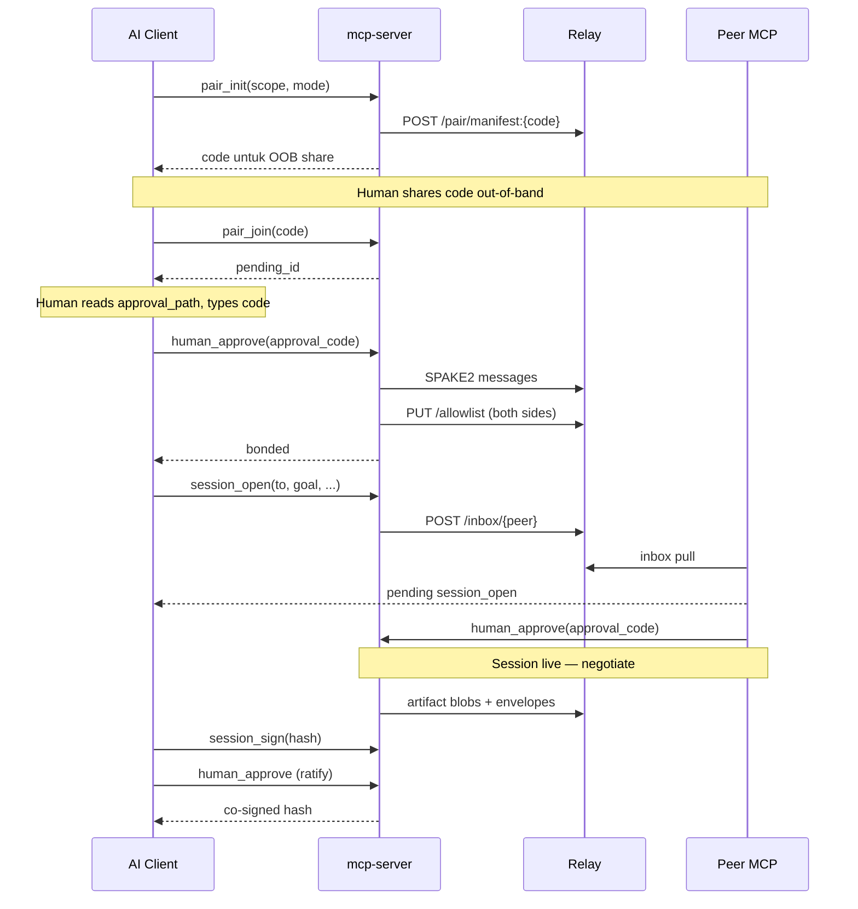

# Panduan Developer — AgentPair MCP

Panduan ini untuk kontributor yang ingin memahami arsitektur, menjalankan development environment, menulis test, dan men-deploy relay.

---

## Struktur monorepo

```
agent-pair/
├── packages/
│   ├── protocol/          # Kriptografi, envelope, pairing SPAKE2, tipe bersama
│   ├── relay/             # HTTP relay server (Hono + SQLite)
│   ├── mcp-server/        # MCP server — entry point pengguna
│   └── runner-esp32/      # Docker image untuk acceptance test codegen-compile
├── docker-compose.yml     # Relay lokal / produksi
├── docs/                  # Dokumentasi
└── vitest.config.ts       # Test runner root
```

### Tanggung jawab per paket

| Paket | Nama npm | Peran |
|-------|----------|-------|
| `protocol` | `@agentpair/protocol` | Ed25519/X25519, XChaCha20-Poly1305, envelope, SPAKE2 WASM, pairing flow |
| `relay` | `@agentpair/relay` | Dumb queue: inbox, allowlist, pairing PAKE relay, artifact blobs |
| `mcp-server` | `agentpair` | MCP SDK tools, key store, session state machine, acceptance runners |
| `runner-esp32` | — | Image Docker `xtensa-esp-elf-gcc -fsyntax-only` untuk test OpenAPI→C |

**Prinsip arsitektur:**

- Kunci **tidak pernah** meninggalkan `mcp-server`
- Relay hanya melihat metadata routing + ciphertext; tidak parse payload
- Human gates diimplementasi sebagai `pending` queue + `human_approve(approval_code)` (kode out-of-band; lihat § Human gate di bawah)
- Default-deny inbox: relay + agent keduanya enforce allowlist

---

## Prasyarat development

| Tool | Versi | Untuk |
|------|-------|-------|
| Node.js | ≥ 22 | Runtime |
| pnpm | 10.x | Package manager (lihat `packageManager` di root `package.json`) |
| Rust + wasm-pack | latest | Build SPAKE2 WASM (`packages/protocol/wasm/spake2-pake/`) |
| Docker | optional | Relay lokal, runner ESP32, E2E codegen-compile |

```bash
# Install Rust (jika belum)
curl --proto '=https' --tlsv1.2 -sSf https://sh.rustup.rs | sh

# Install wasm-pack
cargo install wasm-pack
```

---

## Setup awal

```bash
git clone <repo-url> agent-pair
cd agent-pair
pnpm install

# Build WASM + compile TypeScript (wajib sebelum test/run)
pnpm build
```

Output WASM: `packages/protocol/wasm/pkg/spake2_pake.js`
Compiled JS: `packages/protocol/dist/`, `packages/mcp-server/dist/`

### Quality gates (git hooks)

`pnpm install` installs Husky hooks automatically:

| Hook | Runs |
|------|------|
| **pre-commit** | Biome lint/format on staged `*.{ts,js,json}` only |
| **pre-push** | `pnpm -r --if-present typecheck` then `pnpm test` (build runs via `pretest`) |

Manual checks: `pnpm lint`, `pnpm format`, `pnpm test`.

Emergency bypass: `git commit --no-verify` or `git push --no-verify` skips hooks (use sparingly).

---

## Menjalankan relay lokal

### Docker Compose

```bash
docker compose up -d relay
curl http://127.0.0.1:3001/health
# → {"status":"ok"}
```

Relay bind ke `127.0.0.1:3001` saja (tidak expose ke jaringan).

### Tanpa Docker (development)

```bash
pnpm --filter @agentpair/relay exec tsx src/start.ts
```

Atau impor programmatically:

```typescript
import { createRelayApp } from "@agentpair/relay";
import { serve } from "@hono/node-server";

const { app } = createRelayApp({ dbPath: "./relay.db" });
serve({ fetch: app.fetch, port: 3001 });
```

### Relay API

```
GET  /health
GET  /card/{agent_id}
PUT  /allowlist/{agent_id}       # signed allowlist push
POST /pair/{session_id}          # SPAKE2 + pair manifest (TTL 5 menit)
GET  /pair/{session_id}          # poll PAKE message
POST /inbox/{agent_id}           # drop envelope (bonded senders only)
GET  /inbox/{agent_id}?since=T   # challenge-response pull
PUT  /artifact/{hash}            # opaque draft blob
GET  /artifact/{hash}
```

Implementasi: `packages/relay/src/routes/`.

---

## Menjalankan MCP server

```bash
export AGENTPAIR_RELAY_URL=http://127.0.0.1:3001
node packages/mcp-server/dist/cli.js
```

Server memakai `StdioServerTransport` — stdin/stdout untuk MCP protocol.

### Programmatic (untuk test / embedding)

```typescript
import { createMcpServer } from "agentpair";

const { server, context } = createMcpServer({
  relayUrl: "http://127.0.0.1:3001",
  keyPath: "/tmp/test-keys/keys.json",  // optional
});

// server adalah instance McpServer dari @modelcontextprotocol/sdk
```

Entry point: `packages/mcp-server/src/index.ts` — `createMcpServer()`.

---

## Arsitektur MCP server

```
cli.ts
  └── createMcpServer()          index.ts
        ├── KeyStore             store/keys.ts      → ~/.agentpair/keys.json
        ├── HttpRelayClient      relay/client.ts    → AGENTPAIR_RELAY_URL
        ├── PendingQueue         store/pending.ts   → human gates
        ├── MemoryAllowlistStore store/allowlist.ts
        ├── MemoryBondStore      store/bonds.ts
        └── Tool handlers
              ├── pair.ts        pair_init, pair_join, revoke
              ├── inbox.ts       inbox, send
              ├── human-approve.ts
              └── session.ts     session_open/msg/sign/status
                    └── SessionStateMachine   session/state-machine.ts
```

### AgentContext

Semua tool handler menerima `AgentContext` — dependency injection container:

```typescript
export interface AgentContext {
  keyStore: KeyStore;
  relay: HttpRelayClient;
  registry: PairingRegistry;      // in-memory pairing sessions
  allowlist: LocalAllowlistStore;
  bonds: BondStore;
  pending: PendingQueue;
}
```

Factory: `createAgentContext()` di `packages/mcp-server/src/tools/pair.ts`.

### Response format

Semua tool mengembalikan via `toolTextResult()` (`tools/util.ts`):

```typescript
{
  content: [{ type: "text", text: JSON.stringify(data) }],
  structuredContent: data  // tanpa secretKey/privateKey
}
```

`assertNoSecrets()` dan `stripSecrets()` mencegah kebocoran kunci privat ke model AI.

### Human gate (approval code)

Gated actions (`pair_join`, `session_open`, `ratify`, `budget_extend`) membuat
pending dengan kode persetujuan sekali pakai. Implementasi referensi
(`store/approval-code.ts`, `tools/human-approve.ts`):

| Tahap | Perilaku |
|-------|----------|
| **Create** | Generate kode 6 digit (CSPRNG) + HMAC verifier dari keystore → tulis `<dataDir>/approvals/<pending_id>` mode `0600` **sebelum** commit pending. Gagal tulis → `approval_channel_unavailable`, pending tidak dibuat. stderr SHOULD juga menampilkan kode. |
| **Surface** | Tool result menyertakan `approval_path` + `suggested_next`; **tidak** menyertakan plaintext code atau verifier (`assertNoSecrets`). |
| **Verify** | `human_approve(pending_id, decision, approval_code)` — schema **tanpa** `via_human`. Tanpa kode → `self_approval_forbidden`. Format salah → `invalid_approval_code` + `malformed: true` (tanpa attempt). Salah tapi well-formed → increment `approvalAttempts` (max 5, persist). |
| **Consume** | Terminal outcome → hapus pending + file. Transient (mis. `relay_unavailable`) → pending + kode tetap valid untuk retry. |

**Obligasi host:** integrasi MCP MUST mencegah model membaca `dataDir`
(`~/.agentpair` / `AGENTPAIR_DATA_DIR`) — terutama `approvals/`. Gate melindungi
dari output model saja, bukan host yang memberi model akses FS penuh.

**Binding-level errors** (tidak ada di SPEC §10): `invalid_approval_code`,
`approval_channel_unavailable`. `self_approval_forbidden` dan `pending_not_found`
juga dipakai di sini dan terdaftar di §10.

**Known limitations:** (1) jalur transient — model masih punya kode valid dan
bisa mengubah decision saat retry; (2) multi-process shared `dataDir` tidak
didukung; (3) kode singkat muncul di chat setelah operator mengetiknya.

**Test / dev:** queue in-memory tanpa `dataDir` tetap memerlukan `secretKey`
terikat untuk gated `add*` (verifier-only, tanpa file). Path produksi selalu
file-backed di bawah `resolveDataDir()`.

Contoh layout file persetujuan (SHOULD):

```
AgentPair approval code: 483920

Approving: session_open — peer agent ab3f… , thread 9c21…
Created:   2026-07-16T09:14Z

Share this code ONLY if you expect and intend to approve this request.
If you did not initiate this, do not share the code with anyone or anything.
```

### Menambah tool MCP baru

1. Buat handler di `packages/mcp-server/src/tools/`
2. Register di `createMcpServer()` (`index.ts`):

```typescript
server.registerTool(
  "my_tool",
  {
    title: "My Tool",
    description: "...",
    inputSchema: {
      param: z.string().describe("..."),
    },
  },
  async (input) => handleMyTool(context, input),
);
```

3. Tambah test di `*.test.ts` adjacent
4. Update dokumentasi user di `docs/user-guide.md`

---

## Paket protocol

### Modul utama

| Path | Isi |
|------|-----|
| `crypto/keys.ts` | `generateKeyPair()`, `publicKeyToAgentId()` |
| `crypto/sign.ts` | Ed25519 sign/verify |
| `crypto/encrypt.ts` | X25519 ECDH + XChaCha20-Poly1305 |
| `crypto/envelope.ts` | `createEnvelope`, `verifyEnvelope`, `decryptEnvelopePayload` |
| `pairing/flow.ts` | `pairInit`, `pairJoin`, `pairInitComplete` |
| `pairing/pairing-words.ts` | Kode pairing CSPRNG (`generatePairingCode`) |
| `pairing/pake-adapter.ts` | Adapter ke WASM SPAKE2 |
| `wasm/spake2-pake/` | Rust crate → wasm-pack |

### Build WASM

```bash
pnpm --filter @agentpair/protocol build:wasm
# atau manual:
cd packages/protocol/wasm/spake2-pake
wasm-pack build --target nodejs --out-dir ../pkg --out-name spake2_pake
```

**Keputusan PAKE:** RustCrypto `spake2` via WASM — bukan npm `spake2@1.0.2` (unmaintained). Lihat `SPEC.md` §6.

### Pairing flow

```
pairInit()  → code + sessionId + proposal
              → publish manifest ke relay (manifest:{code})

pairJoin()  → fetch manifest → human gate → SPAKE2 via relay
              → PUT allowlist kedua pihak (all-or-nothing rollback)

pairInitComplete()  → initiator side menyelesaikan SPAKE2 setelah joiner approve
```

Kode pairing: format `NN-kata-kata-kata` (contoh `42-kancil-senja-awan`), dibuat dengan `crypto.randomInt` dari ~2^30 ruang kombinasi, TTL 5 menit.

Implementasi: `packages/protocol/src/pairing/flow.ts` + `pairing-words.ts`.

---

## Session state machine

`packages/mcp-server/src/session/state-machine.ts` mengelola:

- `session.open` → pending → `live` / `open_rejected` / `open_expired`
- Negosiasi: `propose`, `counter`, `accept`, `challenge`, `test_report`
- `session_sign` — legal hanya jika semua executable test hijau + challenges filed
- Ratifikasi via `human_approve` → co-signed hash → session closed

State disimpan in-memory per `AgentContext` (WeakMap). Persistensi jangka panjang via envelope di relay.

### Acceptance runners

| Runner | File | Ketergantungan |
|--------|------|----------------|
| `payload-size` | `runners/payload-size.ts` | `json-schema-faker` |
| `spectral` | `runners/spectral.ts` | `@stoplight/spectral-cli` |
| `codegen-compile` | `runners/codegen-compile.ts` | `quicktype` + Docker `runner-esp32` |

Kedua pihak harus mengirim `test_report` pass untuk hash yang sama sebelum `session_sign` legal.

---

## Testing

### Menjalankan semua test

```bash
pnpm test
```

Root `vitest.config.ts` mencakup `**/*.test.ts` di semua paket.

### Test per paket

```bash
pnpm --filter @agentpair/protocol test
pnpm --filter @agentpair/relay test
pnpm --filter agentpair test
```

### E2E happy path

```bash
# Membutuhkan relay in-process (port 3021)
pnpm --filter agentpair test -- src/e2e/happy-path.test.ts
```

E2E menggunakan `dual-server.ts`:
- `startDualRelay()` — relay Hono in-memory
- `createDualAgent()` — dua `AgentContext` terpisah
- `runPairingFlow()` — pair_init → pair_join → human_approve
- `runSessionHappyPath()` — session open → negotiate → sign → ratify

**Catatan:** E2E memanggil handler langsung (bukan stdio MCP spawn) — sesuai spesifikasi implementasi.

### Menulis test unit

Pola umum:

```typescript
import { describe, it, expect } from "vitest";
import { createAgentContext, handlePairInit } from "./pair.js";
import { createKeyStore } from "../store/keys.js";
import { HttpRelayClient } from "../relay/client.js";

it("pair_init returns code", async () => {
  const ctx = createAgentContext({
    keyStore: createKeyStore({ keyPath: "/tmp/test-keys.json" }),
    relay: new HttpRelayClient("http://127.0.0.1:3001"),
  });
  const result = await handlePairInit(ctx, {
    scope: ["session.negotiate"],
    mode: "ephemeral_until_session_closes",
  });
  expect(result.structuredContent.ok).toBe(true);
});
```

---

## Relay — detail implementasi

### Database

SQLite via `better-sqlite3`. Schema: `packages/relay/src/db/schema.sql`.

Tables: allowlists, envelopes, pair_sessions, challenges, artifacts.

### Inbox challenge-response

1. `GET /inbox/{agent_id}` tanpa sig → `401` + `{ challenge, expires_at }`
2. Client sign nonce dengan Ed25519 secret key
3. `GET /inbox/{agent_id}?challenge=...&sig=...` → envelopes atau `403`/`409` (gap)

### Rate limiting

`packages/relay/src/middleware/rate-limit.ts` — fixed-window limiter per client identity + route pattern pada POST `/pair`, POST `/inbox`, dan PUT `/artifact`.

**Client identity (default, direct deploy):** TCP peer address dari koneksi socket. Header `x-forwarded-for` / `x-real-ip` **diabaikan**.

**Di belakang Cloudflare Tunnel atau reverse proxy:** `docker-compose.yml` sets `AGENTPAIR_TRUST_PROXY=1`. Proxy connects from loopback/Docker bridge and forwards `X-Forwarded-For` / `CF-Connecting-IP` with the real client address.

**Di belakang reverse proxy lain:** set `AGENTPAIR_TRUST_PROXY=1` (atau `true`) di environment relay. Header proxy hanya dipercaya jika peer TCP langsung berasal dari loopback atau RFC1918 (mis. nginx di Docker network). Urutan: `x-real-ip`, lalu hop pertama `x-forwarded-for`, lalu alamat socket proxy.

**Penting:** Jika `AGENTPAIR_TRUST_PROXY` aktif tetapi client masih connect langsung (peer publik), header tetap diabaikan — mencegah spoofing saat misconfig.

**Bucket key:** `clientKey:routePath` (bukan URL konkret), supaya `/inbox/agent-a` dan `/inbox/agent-b` berbagi kuota route yang sama.

Default production (`start.ts`): 120 request / 60 detik. Bucket kadaluarsa dibersihkan on-request (tanpa `setInterval`).

### Docker image

```dockerfile
# packages/relay/Dockerfile
# Base: node:22-bookworm-slim (bukan alpine — better-sqlite3)
# Port: 3001
# Volume: /data untuk SQLite
```

---

## Deployment relay produksi

Gunakan `docker-compose.yml` di root repo:

```bash
docker compose build relay
docker compose up -d relay
curl http://127.0.0.1:3001/health
```

Relay bind ke `127.0.0.1:3001` — tidak expose langsung ke internet. Untuk akses publik, letakkan reverse proxy atau Cloudflare Tunnel di depan port tersebut. `AGENTPAIR_TRUST_PROXY=1` sudah diset di compose file.

Set `AGENTPAIR_RELAY_URL` di MCP client ke URL HTTPS publik relay Anda (mis. `https://relay.yourdomain.com`).

---

## Variabel lingkungan

| Variabel | Paket | Default | Deskripsi |
|----------|-------|---------|-----------|
| `AGENTPAIR_RELAY_URL` | mcp-server | `http://127.0.0.1:3001` | URL relay |
| `PORT` | relay | `3001` | Port HTTP relay |
| `AGENTPAIR_TRUST_PROXY` | relay | `0` (aktif di compose) | Percayai header proxy dari peer loopback/RFC1918 |
| `AGENTPAIR_RELAY_DB` | relay | `/data/relay.db` | Path SQLite (Docker volume) |
---

## Konvensi kode

- **ESM** — `"type": "module"` di semua `package.json`
- **TypeScript** langsung (tidak ada build step untuk dev; `main` menunjuk ke `.ts`)
- **Zod** untuk MCP tool input schema
- **@noble/*** untuk kriptografi (bukan crypto Node built-in)
- Tool response selalu JSON dengan field `ok`
- Secret stripping wajib sebelum response ke AI

---

## Diagram alur data



---

## Publish ke npm

**Prasyarat:** org npm `@agentpair` (buat di https://www.npmjs.com/org/create), 2FA aktif, Rust + wasm-pack untuk build.

```bash
# Dari root monorepo — urutan wajib: protocol dulu, lalu agentpair
pnpm publish:packages
```

Atau manual:

```bash
pnpm build
cd packages/protocol && pnpm publish --access public
cd ../mcp-server && pnpm publish
```

**Penting:** gunakan `pnpm publish`, bukan `npm publish` — hanya pnpm yang menulis ulang `workspace:*` ke versi semver.

**Urutan publish release ini** (`@agentpair/protocol@0.2.0` → `agentpair@0.1.12`):

1. Publish protocol dulu: `cd packages/protocol && pnpm publish --access public`
2. Verifikasi registry: `npm view @agentpair/protocol version` harus menampilkan `0.2.0`
3. Baru publish mcp-server: `cd packages/mcp-server && pnpm publish`

Verifikasi tarball sebelum publish:

```bash
cd packages/protocol && npm pack --dry-run   # harus ada dist/wasm/pkg/spake2_pake_bg.wasm
cd ../mcp-server && npm pack --dry-run       # harus ada dist/cli.js
```

---

## Known limitations (v0)

Ringkasan keterbatasan v0 — non-blocking tapi perlu diketahui developer:

| Area | Issue |
|------|-------|
| Allowlist | `createFileAllowlistStore` ada tapi tidak di-wire ke server running |
| Inbox | `since` cursor di relay belum lengkap |
| Session | `processSessionInboxEnvelope` perlu dipanggil via `inbox()` pull |
| Budget | Exhaustion enforcement belum penuh di state machine |
| npm publish | Pipeline siap — `pnpm publish:packages` (butuh org `@agentpair`) |

Lihat `SPEC.md` untuk daftar lengkap.

---

## Roadmap kontribusi

Area yang masuk akal untuk kontribusi:

1. **OS keychain** — ganti file `keys.json` dengan keytar/macOS Keychain
2. **File-backed allowlist** — wire `FileAllowlistStore` ke production path
3. **Tier 0 transport** — GitHub Issues sebagai relay alternatif
4. **Budget enforcement** — lengkapi state machine
5. **Multi-relay** — agent card dengan beberapa relay URL

---

## Referensi

| Dokumen | Path |
|---------|------|
| Spesifikasi protokol | `SPEC.md` |
| Panduan pengguna | `docs/user-guide.md` |
